**Exercice 2. Prise en main de l'interpréteur de commandes**

A tout moment, vous pouvez sortir de la VM pour revenir dans le système
hôte en appuyant sur la touche **CTRL (droite)** du clavier.

**Manuel**

1.  A l'aide du manuel, identifiez le rôle de la commande which

> **which localise une commande, un binaire.**

2.  Quand on consulte une page du manuel, comment peut-on rechercher un
    > terme (par exemple, chercher le terme option dans la page de
    > manuel de which ?

> **Il faut appuyer sur « / » puis entrer le terme recherché.**

3.  Comment quitte-t-on le manuel ?

> **En appuyant sur « q »**

4.  Chaque *section* du manuel a une première page, qui présente le
    > contenu de la section. Afficher la première page de la section 6 ;
    > de quoi parle cette section ?

> **La section 6 présente les jeux et programmes annexes disponibles sur
> le système.**

**Navigation dans l'arborescence des fichiers**

1.  allez dans le dossier /var/log

2.  remontez dans le dossier parent (/var) en utilisant un chemin
    > relatif

3.  retournez dans le dossier personnel

4.  revenez au dossier précédent (/var) **sans utiliser de chemin**

5.  essayez d'accéder au dossier /root ; que se passe-t-il ?

> **Nous n'avons pas la permission d'y accéder.**

6.  essayez la commande sudo cd /root ; que se passe-t-il ? Expliquez

> **La commande « cd » n'est pas reconnu parce que c'est une commande
> intégrée au shell, il faut utiliser l'option --s ou se connecter en
> root à l'aide de « sudo --s »**

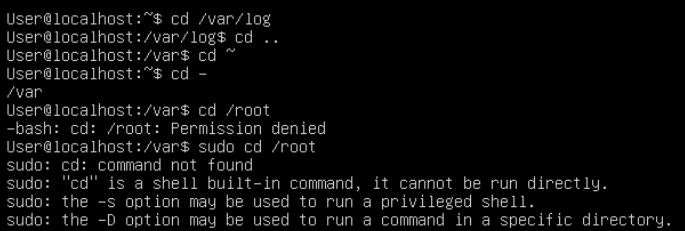{width="6.5in"
height="2.191666666666667in"}

> 7\. à partir de votre dossier personnel, créez l'arborescence suivante
> :

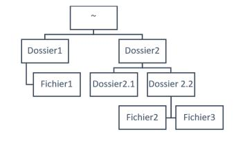{width="1.8444444444444446in"
height="1.0694444444444444in"}

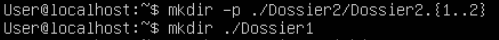{width="5.198611111111111in"
height="0.4166666666666667in"}

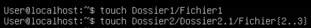{width="5.542361111111111in"
height="0.5in"}

8.  revenez dans votre dossier personnel ; à l'aide de la commande rm,
    > essayez de supprimer Fichier1, puis Dossier1 ; que se passe-t-il ?

> **Le « Fichier1 » se supprime mais la commande ne fonctionne pas pour
> Dossier1 car c'est un chemin et non un fichier.**

9.  quelle commande permet de supprimer un dossier ?

> **« rm --d »**

10. que se passe-t-il quand on applique cette commande à Dossier2 ?

> **La commande ne fonctionne pas car le Dossier2 n'est pas vide.**

11. comment supprimer en une seule commande Dossier2 et son contenu ?

> **« rm --rd »**

**Commandes importantes**

1.  Quelle commande permet d'afficher l'heure ? A quoi sert la commande
    > **time** ?

> **« date », la commande « time » permet de déterminer le temps que
> prend une commande pour s'exécuter.**

2.  Dans votre dossier personnel, tapez successivement les commandes
    > **ls** puis **la** ; que peut-on en déduire sur les fichiers
    > commençant par un point ?

> **Les fichiers commençant par un point son cachés par défaut.**

3.  Où se situe le programme **ls** ?

> **Le programme « ls » se situe dans « /usr/bin/ls ».**

4.  Essayez la commande **ll**. Existe-t-il une entrée de manuel pour
    > cette commande ? Utilisez les com-mandes **alias** ou **alias**
    > pour en savoir plus sur la nature de cette commande.

> **Il n'y a pas d'entrée dans le manuel parce que la commande est une
> variable d'environnement permettant d'exécuter une autre commande « ls
> --alF »**

5.  Quelle commande permet d'afficher les fichiers contenus dans le
    > dossier **/bin** ?

> **« ls -ap \| grep -v / »**

6.  Que fait la commande **ls ..** ?

> **La commande affiche le contenu du dossier parent au chemin de
> travail.**

7.  Quelle commande donne le chemin complet du dossier courant ?

> **« pwd »**

8.  Que fait la commande **echo \'bip\' \> plop** exécutée 2 fois ?

> **Elle écrit « bip » dans le fichier « plop » une seule fois car elle
> écrase le contenu précédent à chaque itération.**

9.  Que fait la commande **echo \'bip\' \>\> plop** exécutée 2 fois ?

> **Elle écrit « bip » deux fois dans le fichier « plop » car elle écrit
> le contenu à la fin du fichier à chaque itération.**

10. Interprétez le comportement de la commande **sleep 10 \| echo
    > \'toto\'** ?

> **La commande écrit « toto » puis attends 10 secondes avant de se
> terminer.**

11. A quoi sert la commande **file** ? Essayez la sur des fichiers de
    > types différents.

> **La commande « file » permet de décrire le type de contenu du
> fichier.**

12. Créez un fichier **original** qui contient la chaîne **Hello Toto
    > !** ; créer ensuite un lien **lien_phy** vers ce fichier avec la
    > commande **ln original lien_phy**. Modifiez à présent le contenu
    > de **original** et affichez le contenu de **lien_phy** :
    > qu'observe-t-on ? Supprimez le fichier **original** ; quelle
    > conséquence cela a-t-il sur **lien_phy** ?

> **Le contenu de « lien_phy » se modifie à chaque modification de
> « original » mais ne disparaît pas lors de la suppression de
> « original » et garde le dernier contenu de ce dernier.**

13. Créez à présent un lien *symbolique* **lien_sym** sur **lien_phy**
    > avec la commande **ln -s lien_phy lien_sym**. Modifiez le contenu
    > de **lien_phy** ; quelle conséquence pour **lien_sym** ? Et
    > inversement ? Supprimez le fichier **lien_phy** ; quelle
    > conséquence cela a-t-il sur **lien_sym** ?

> **La modification du contenu d'un des deux fichiers modifie le contenu
> de l'autre, la suppression de « lien_phy » a supprimé aussi
> « lien_sim » qui apparaît cependant toujours avec la commande
> « ls ».**

14. Affichez à l'écran le fichier **/var/log/syslog**. Quels raccourcis
    > clavier permettent d'interrompre et reprendre le défilement à
    > l'écran ?

> **« CTRL + S » interrompt le défilement tandis que « CTRL + Q » le
> reprend.**

15. Affichez les 5 premières lignes du fichier **/var/log/syslog**, puis
    > les 15 dernières, puis seulement les lignes 10 à 20.

> **5 premières lignes :**
>
> 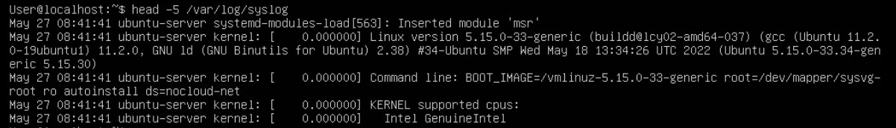{width="6.638888888888889in"
> height="0.95in"}
>
> **15 dernières lignes :**
>
> 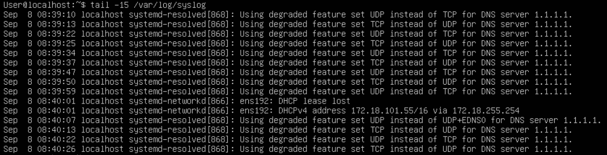{width="6.638888888888889in"
> height="1.7041666666666666in"}
>
> **Lignes 10 à 20 :**
>
> 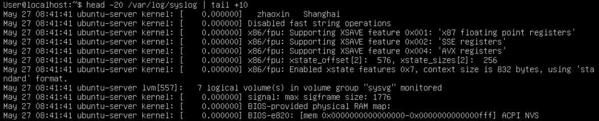{width="6.638888888888889in"
> height="1.3444444444444446in"}

16. Que fait la commande **dmesg \| less** ?

> **La commande dmesg affiche la mémoire tampon de message du noyau
> linux et la commande « less » accompagnée d'un pipe permet de ne pas
> afficher tout le contenu d'un seul coup et laisse l'utilisateur
> défiler dans les entrées. La commande a cependant besoin d'être
> utilisée en root ou avec un « sudo » pour fonctionner.**

17. Affichez à l'écran le fichier **/etc/passwd** ; que contient-il ?
    > Quelle commande permet d'afficher la page de manuel de ce fichier ?

> 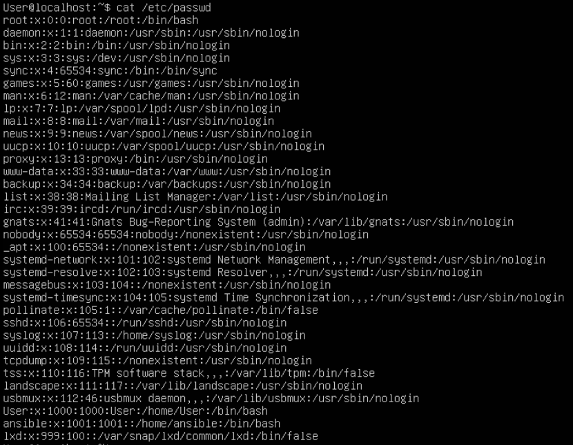{width="4.845972222222223in"
> height="3.765766622922135in"}
>
> **Le fichier « passwd » est une base de données textuelle
> d\'informations sur les utilisateurs qui peuvent se connecter au
> système ou sur d\'autres identités d\'utilisateurs du système
> d\'exploitation qui possèdent des processus en cours d\'exécution.**

18. Affichez seulement la première colonne triée par ordre alphabétique
    > inverse

> 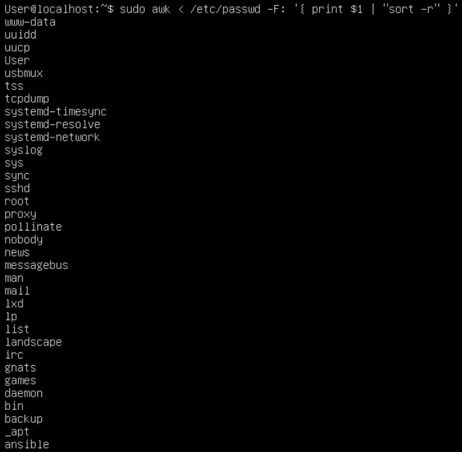{width="4.180179352580927in"
> height="4.091416229221347in"}

19. Quelle commande nous donne le nombre d'utilisateurs ayant un compte
    > sur cette machine (pas seulement les utilisateurs connectés) ?

> **« awk \< /etc/password --F: '{ print \$1}' \| wc --l »**

20. Combien de pages de manuel comportent le mot-clé **conversion** dans
    > leur description ?

> **Aucune description ne contient le mot clé « conversion »**
>
> 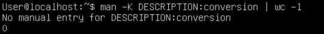{width="5.6570395888014in"
> height="0.6042508748906387in"}

21. A l'aide de la commande **find**, recherchez tous les fichiers se
    > nommant **passwd** présents sur la machine

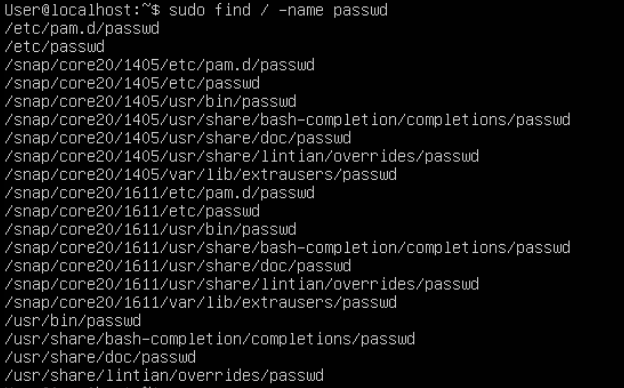{width="3.56422353455818in"
height="2.2162160979877514in"}

22. Modifiez la commande précédente pour que la liste des fichiers
    > trouvés soit enregistrée dans le fichier
    > **\~/list_passwd_files.txt** et que les erreurs soient redirigées
    > vers le fichier spécial **/dev/null**

> **« find / -name passwd \> \~/list_passwd_files.txt 2\> /dev/null »**

23. Dans votre dossier personnel, utilisez la commande **grep** pour
    > chercher où est défini l'alias **ll** vu précédemment

> **grep -rl alias \~/.bash\* \~/.profile /etc/profile
> /etc/bash.bashrc**

24. Utilisez la commande **locate** pour trouver le fichier
    > **history.log**.

> {width="3.2087806211723535in"
> height="0.34379811898512685in"}

25. Créer un fichier dans votre dossier personnel puis utilisez locate
    > pour le trouver. Apparaît-il ? Pourquoi ?

> **Non il n'apparaît pas puisque nous sommes déjà dans le dossier
> parent du fichier.**

**Travailler avec plusieurs shells**

On peut utiliser jusqu'à 6 shells en parallèle. Ils portent les noms
**ttyX** (où X va de 1 à 6) et sont accessibles via **Alt + FX**

**Exercice 3. Découverte de l'éditeur de texte nano**

1.  Copiez le fichier /var/log/syslog dans votre dossier personnel sous
    > le nom log.txt, puis ouvrez-le avec nano

2.  Remplacez toutes les occurrences du mot kernel par le mot noyau

> **Appuyer sur ALT + R puis entrer le mot à remplacer, le mot
> remplaçant, appuyer sur A pour « all » et enregistrer.**

3.  Déplacer les 10 premières lignes à la fin du fichier

> **Appuyer sur CTRL + \^ pour placer un marqueur, descendre avec les
> flèches pour sélectionner les dix premières lignes, appuyer sur CTRL +
> K pour couper. Appuyer sur ALT + / pour aller à la fin du fichier puis
> CTRL + U pour coller les lignes.**

4.  Annulez cette action

> **Appuyer sur ALT + U.**

5.  Enregistrez le fichier avant de quitter nano

> **CTRL + X -\> y**

**Exercice 4. Personnalisation du shell**

Le shell par défaut est plutôt austère, mais il existe de nombreux
moyens de le personnaliser, en modifiant le fichier **\~/.bashrc**.

1.  Commencez par créer une copie de ce fichier, que vous appellerez
    > **.bashrc_bak**

> **cp ./.bashrc ./.bashrc_bak**

2.  Editez le fichier **.bashrc** avec nano et décommentez la ligne
    > **force_color_prompt=yes** pour activer la couleur. Enregistrez le
    > fichier et quittez nano.

> **F6 puis chercher force_color_prompt et décommenter. CTRL + X pour
> sauvegarder.**

3.  Le fichier **.bashrc** est lu au *démarrage* du shell ; pour le
    > recharger, il faudrait donc se déconnecter puis se reconnecter ;
    > mais il existe un autre moyen : la commande **source .bashrc**.
    > Testez-la, l'invite de commande devrait immédiatement passer en
    > couleurs.

> {width="3.5317432195975504in"
> height="0.4271434820647419in"}

4.  Les couleurs par défauts (surtout celle du dossier courant) ne sont
    > pas très visibles. Dans **.bashrc**, cherchez les lignes
    > commençant par **PS1=** ; elles indiquent la mise en forme de
    > l'invite de commande (selon que l'on est en couleurs ou non).

> **Modifiez l'invite de commande pour qu'elle s'affiche sous la forme
> suivante :**
>
> \[heure\] - user\@host:chemin_courant\$
>
> où l'heure est affichée en violet et entre crochets, et le chemin du
> dossier courant en cyan
>
> 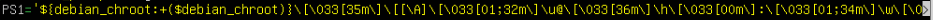{width="6.5in"
> height="0.13958333333333334in"}
>
> {width="2.0419520997375327in"
> height="0.21878062117235345in"}
